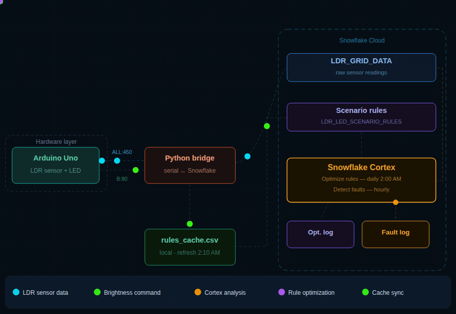

LumiSense Grid

**Intelligent IoT Sensor Management — Powered by Snowflake Cortex**

> A self-improving IoT system where Snowflake Cortex learns real sensor patterns, autonomously rewrites human-defined rules, and detects faulty hardware — without any manual intervention.

---

## Architecture



| Color | Flow |
|-------|------|
| 🔵 Cyan | LDR sensor data — Arduino → Python → Snowflake |
| 🟢 Green | Brightness command — Rules → CSV cache → Python → Arduino LED |
| 🟠 Amber | Cortex analysis — LDR_GRID_DATA → Cortex (daily 2:00 AM) |
| 🟣 Purple | Rule optimization — Cortex → LDR_LED_SCENARIO_RULES + Opt. Log |

---

## What This Project Does

Industries across the globe operate hundreds of IoT sensors across its manufacturing floor running on static, human-defined rules. These rules cannot adapt to real patterns and faulty sensors go undetected until they cause downtime.

LumiSense solves two problems simultaneously:

- **Self-improving rules** — Snowflake Cortex analyzes 24 hours of sensor data daily and autonomously rewrites the brightness rules. Human-defined policies are replaced by AI-learned policies.
- **Automated fault detection** — Every 12 hours, Cortex analyzes each sensor's behavioral pattern and flags DEAD, FROZEN, NOISY, SILENT, or WRONG_PATTERN sensors with severity and recommended action.

### Why LDR + LED?

The hardware is a simulation. The LDR represents any industrial IoT sensor. The LED represents any actuator. The Cortex intelligence layer is identical to what would govern real production sensors at scale.

---

## Key Metrics

| Metric | Value |
|--------|-------|
| Avg energy saving | 20% across all 15 scenarios |
| Fault detection cycle | Every 12 hours — fully automated |
| Snowflake API calls | 96/day |
| Rule optimization | Daily at 2:00 AM — zero human intervention |
| Manual interventions | None |

---

## Snowflake Tables

| Table | Purpose |
|-------|---------|
| `LDR_GRID_DATA` | Raw sensor readings — light_id, ldr_value, hour_of_day, timestamp |
| `LDR_LED_SCENARIO_RULES` | 15 AI-managed brightness rules — updated daily by Cortex |
| `LDR_LED_OPTIMIZATION_LOG` | Full audit trail of every rule change with Cortex reason |
| `SENSOR_HEALTH_LOG` | 12-hourly fault detection results — fault_type, severity, action |
| `fact_dashboard` | Pre-computed 30-day fact table powering all 20 Snowsight tiles |

---

## Setup — Run Order


### Step 1 — Hardware & Transmission

1. Setup arduino MC
2. Setup python bridge or any mode for transmission of data to snowflake

### Step 2 — Snowflake

1. database_creation.sql - Create all the tables from this script
2. LumiSenseBrigthnessRules.sql - Ingest all the rules defined for LDR, LED
3. OptimizationLog.sql - Create the procedure and task, its for optimizing the rules
   i. Create the stored procedure SP_OPTIMIZE_SCENARIO_RULES
   ii. Create the task TASK_OPTIMIZE_SCENARIO_RULES, it runs at scheduled time
   iii. Check LDR_LED_OPTIMIZATION_LOG table for any findings
4. faultySensorDetection.sql - Create the procedure and task, its for detecting the faulty sensors
   i. Create the stored procedure SP_OPTIMIZE_SCENARIO_RULES
   ii. Create the task TASK_OPTIMIZE_SCENARIO_RULES, it runs at scheduled time
   iii. Check SENSOR_HEALTH_LOG table for any findings      
5. Create the fact_dashboard table
6. Populate fact_dashboard table with lumisense_fact_populate.ipynb, which gives mockup data
7. Create the dashboard from LumiSense_Dashboard_SQL.docx which is in documents folder

Note: SQL files are under SnowflakeData/sql
Check the tasks, logs. No manual intervention is required.

---

## How It Keeps Running

Once set up, everything is automatic:

```
Every 90 seconds    → Arduino reads LDR → Python writes to LDR_GRID_DATA
Every 15 minutes    → Python reads CSV cache → sends brightness to Arduino
Every 12 hours      → TASK_SENSOR_HEALTH fires → SP_DETECT_SENSOR_FAULTS runs
Daily at 2:00 AM    → TASK_OPTIMIZE fires → SP_OPTIMIZE_SCENARIO_RULES runs
                      Cortex analyzes patterns → rewrites rules
Daily at 2:10 AM    → Python CSV cache refreshed from Snowflake
                      (10 min after optimization task completes)
```
---

## Snowflake Cortex Roles

### Role 1 — Reinforcement Learning & Autonomous Rule Redefinition

Cortex reads 24 hours of sensor data, identifies patterns, and rewrites the rules that govern sensor behavior. The procedure runs nightly via a Snowflake Task.

```
Agent         → Snowflake Cortex (mistral-7b)
Environment   → IoT sensor grid
State         → LDR value + hour of day
Action        → Brightness level (0-100%)
Reward        → Energy saved % = 100 - brightness
Policy update → Daily at 2:00 AM via Task
```

Six safety guardrails protect every rule change — pre-filter (min 15 readings), eligible ID check, no-op check, max 10% change cap, per-scenario floor/ceiling, and reason coherence check.

### Role 2 — Cost Optimization & Operational Insights

Every AI decision is measured and logged. Cost savings, CO2 savings, energy consumption, and sensor health are surfaced through a 20-tile Snowsight dashboard with 15-minute auto-refresh.

---

## Built With

- **Arduino Uno** — ATmega328P microcontroller
- **Python 3.10+** — pyserial, snowflake-connector-python, python-dotenv
- **Snowflake** — LUMISENSE_DB / LUMISENSE_SCHEMA
- **Snowflake Cortex** — mistral-7b via CORTEX.COMPLETE
- **Snowsight** — 20-tile live dashboard

---
